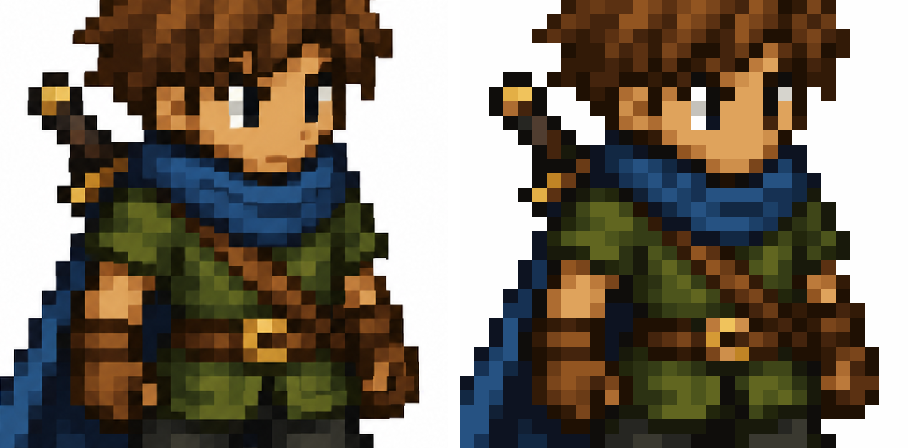
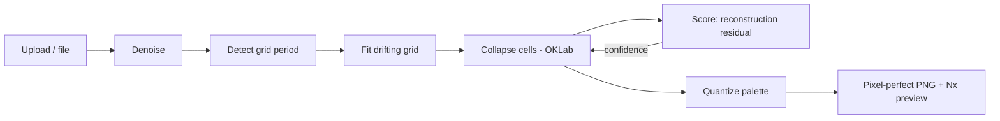

# Pixel-Perfect

[](https://github.com/ventz/pixel-perfect/actions/workflows/ci.yml)
[](https://www.python.org/)
[](LICENSE)

Turn AI-generated "pixel art" — which only *looks* like pixel art — into a **true, 100% pixel-perfect image**: every logical pixel an exact integer N×N block on a uniform grid, a limited palette, and zero anti-aliasing.



<sub>Left: a detail of an AI-generated sprite (`examples/example-image.png`). Right: the same region of the restored native image, nearest-neighbor upscaled for viewing.</sub>

## Table of Contents

- [Overview](#overview)
- [Quick Install](#quick-install)
- [Features](#features)
- [Usage](#usage)
- [Documentation](#documentation)
- [Architecture](#architecture)
- [Security](#security)
- [Contributing](#contributing)
- [License](#license)

## Overview

AI image models (Stable Diffusion, Midjourney, Nano-Banana, DALL·E, …) produce pixel-art-*flavored* output with three structural defects that make it unusable in a real game pipeline:

- **Drifting grid** — the upscale factor isn't constant, so logical cells vary in size (15px next to 17px) and the grid sits off the integer lattice.
- **Anti-aliased / blurry edges** — the diffusion VAE smooths the hard edges pixel art requires.
- **Color explosion** — hundreds of colors plus JPEG noise instead of a deliberate limited palette.

Pixel-Perfect removes all three deterministically — no model, no GPU, no network. It also covers fixing the problem at *generation* time — see [Fixing pixel art at generation time](docs/explanation/generation.md).

## Quick Install

```bash
git clone https://github.com/ventz/pixel-perfect
cd pixel-perfect
uv sync
uv run app.py
# Open http://127.0.0.1:8000
```

Requires Python 3.11+ and [uv](https://docs.astral.sh/uv/). For pip and other options, see [Getting Started](docs/getting-started.md).

## Features

- **Robust grid recovery** that tolerates drift, blur, and JPEG noise — not just a global FFT ([how it works](docs/architecture.md)).
- **Reconstruction-residual scoring** picks the grid that best explains the source as *damaged* pixel art, and yields a per-cell **confidence heatmap**.
- **Perceptual palette quantization** in OKLab, with auto color count or snap-to-named-palette: Sweetie-16, PICO-8, Endesga-32 ([guide](docs/how-to/use-named-palettes.md)).
- **Built-in pixel editor** for hand touch-ups — pencil, fill, eraser, eyedropper, undo/redo, palette-first colors plus any RGB ([guide](docs/how-to/edit-pixels.md)).
- **Three surfaces over one core**: a Python library, a CLI, and a FastAPI web app where every stage is an API endpoint.
- **Auto + manual**: one-click auto-detect, with overrides (native size, palette size, denoise, interior) for the hard cases ([guide](docs/how-to/fix-hard-cases.md)).

## Usage

Restore from the CLI — writes the true native image plus an 8× nearest-neighbor preview:

```bash
uv run pixelperfect restore examples/messy_sprite.jpg clean.png --palette 8 --upscale 8
# messy_sprite.jpg -> clean.png  [16x16, 8 colors, conf 0.98]
#   preview: clean_x8.png
```

Inspect detection without writing anything:

```bash
uv run pixelperfect analyze examples/messy_sprite.jpg
```

Or from Python:

```python
from pixelperfect import PipelineParams, restore
from pixelperfect.io import load_rgb, save_png

result = restore(load_rgb("messy.png"), PipelineParams(palette_size=16))
save_png(result.native, "clean.png")  # result.score.confidence, result.palette, ...
```

Batch folders, named palettes, and every flag are covered in the [CLI Reference](docs/reference/cli.md).

## Documentation

| Section | Description |
|---------|-------------|
| [Getting Started](docs/getting-started.md) | First restoration, end to end (tutorial) |
| [How-To Guides](docs/how-to/) | Edit pixels, batch processing, named palettes, hard cases, self-hosting |
| [CLI Reference](docs/reference/cli.md) | Every command and flag |
| [API Reference](docs/reference/api.md) | Every HTTP endpoint |
| [Configuration](docs/reference/configuration.md) | Every `PipelineParams` option |
| [Architecture](docs/architecture.md) | How grid detection and scoring work |
| [Generation-side guidance](docs/explanation/generation.md) | Fixing the problem at the source |

## Architecture



One core library (`src/pixelperfect/`) is wrapped by the CLI, the FastAPI service, and the test suite, so all three run identical code. Full detail in [docs/architecture.md](docs/architecture.md).

## Security

The web service is **unauthenticated and compute-intensive**, and binds to `127.0.0.1` by default. Do not expose it to a network without a reverse proxy providing TLS, auth, and rate limiting. See [SECURITY.md](SECURITY.md) to report a vulnerability.

## Contributing

Contributions welcome — see [CONTRIBUTING.md](CONTRIBUTING.md) for dev setup, testing, and code style. Notable changes are tracked in [CHANGELOG.md](CHANGELOG.md).

## License

[MIT](LICENSE) © Ventz Petkov
