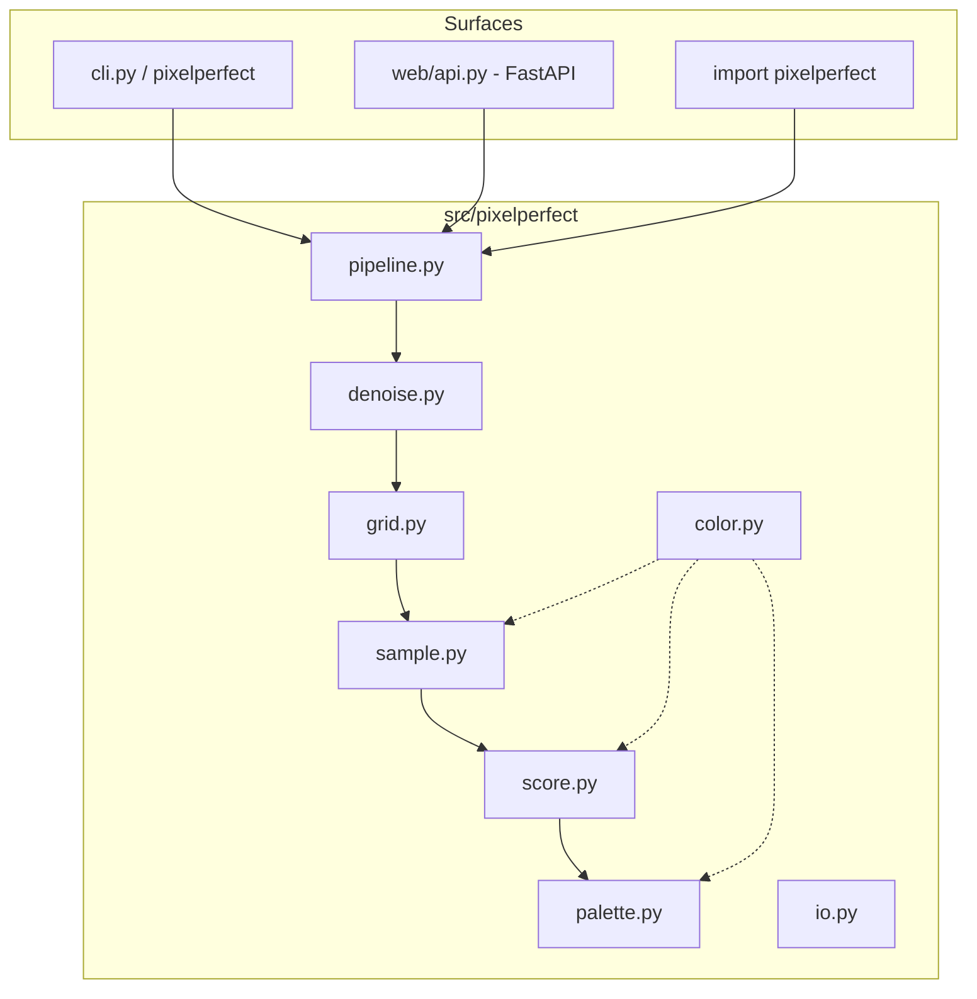
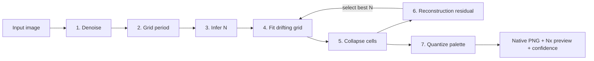

# Architecture

This page explains *how* Pixel-Perfect recovers a true grid from a damaged
image, and *why* it works the way it does. For exact options see the
[Configuration reference](reference/configuration.md); for the code entry points
see the [API](reference/api.md) and [CLI](reference/cli.md) references.

## One core, three surfaces

The CLI, web service, and tests all call the same `pipeline.restore()` /
`pipeline.analyze()`, so behavior never diverges between surfaces.

## The pipeline

### 1. Denoise (`denoise.py`)
AI exports are usually JPEGs, so flat cells carry DCT ringing that corrupts both
grid detection and per-cell color. An edge-preserving denoise (bilateral +
Non-Local Means, or a median fallback) flattens intra-cell noise while keeping
true cell boundaries. Alpha channels pass through untouched.

### 2–3. Grid period & cell count (`grid.py`)
The grid is **not** perfectly periodic, so a raw 2-D FFT smears once cells
drift. Instead we sum the per-pixel edge strength into 1-D **projection
profiles** (one per axis); their peaks are the gridlines. Edge strength is the
perceptual step in **OKLab** — not luminance, so two equally bright colors still
form an edge — premultiplied by alpha, with alpha itself as an extra channel, so
a silhouette is an edge and the hidden RGB under transparent pixels carries no
signal.

The **autocorrelation** of each profile gives the average period, refined to
sub-pixel precision by fitting the peaks at its multiples (a 10.5 px scale reads
as 10.5, not 10 or 11). The cell count `N` is `length / period`, snapped toward
common pixel-art sizes (16/32/48/64…) and offered as a **tight** ranked candidate
list with its ±1/±2 neighbors. An FFT estimate is added only when it agrees with
the autocorrelation period or with one-half or one-third of it; any other
disagreement is treated as a harmonic and ignored.

### 4. Fit the drifting grid (`grid.py`)
Given `N`, the `N+1` boundaries are placed by a **dynamic program over every
integer position**. Each cell's *width* may range over `period × (1 ±
fit_window_frac)`, and the path maximizes edge energy at the chosen lines minus
a `fit_smoothness`-weighted penalty on each width's deviation from the mean.
Because widths — not positions around a uniform lattice — are constrained, drift
can **accumulate**: a run of 17 px cells followed by 15 px cells lands every line
correctly even where it sits a full cell away from the uniform position. Uneven
margins are absorbed into the edge cells the same way.

### 5. Collapse cells (`sample.py`)
Each cell becomes one color. To dodge anti-aliasing, only the **eroded interior**
(central ~50%) of each cell votes, and the representative is a robust statistic
(channel-wise median by default) computed in **OKLab**, a perceptually-uniform
color space — never a mean, which smears blended edge pixels into the result.
Transparent pixels never vote for an opaque cell. Interiors are gathered into
one padded array and reduced in a single vectorized call rather than a per-cell
loop.

### 6. Reconstruction-residual scoring (`score.py`)
This is the differentiator. For each candidate grid we collapse the cells, then
**re-render** them (nearest-neighbor) back into the original warped layout and
measure the robust OKLab residual against the source. The best grid is the one
that makes the source *most explainable as damaged pixel art*. This beats pure
edge-energy on images with smooth gradients between similar colors, and the
per-cell residual doubles as a **confidence heatmap**. Scoring on the eroded
interior also prevents the metric from preferring a needlessly fine grid. With
alpha, a pixel whose opacity disagrees with its cell counts as a bad match.

Selection minimizes the residual **scaled by period agreement**: each
candidate's residual is multiplied by `1 + 2 × (dev_x + dev_y)`, where `dev` is
the relative distance from its implied cell size (`length / N`) to the nearest
measured period. Residual alone still drifts toward finer grids by a percent or
two — enough to pick 33 over 32 on 5 px cells, or let 37 "tie" with 40 on a
sparse sprite — while the measured period is precise in both cases. A 3%
mismatch costs 6%, more than a needlessly fine grid gains and far less than a
real improvement. Scores within a small relative tolerance of the best are
tied. Among tied grids, an exact subdivision of another tied grid is dropped
(its interiors never straddle a true edge, so it can always tie), then common
sizes and fewer cells win. The OKLab conversion, profiles, and each axis's gridline fits are
computed once per image and shared across all candidate combinations.

**Half-resolution check.** Sparse line art (1 px lines on a mostly empty
background) can produce an edge profile that repeats every *two* cells, so the
true count is never among the candidates. After selection, each detected axis is
checked for real edge energy at its cell *midpoints*. Only if the midpoints
carry edges (on a correct grid they fall in flat color) are about twice as many
cells tried, including the neighbors and nearest common size. The finer grid is
kept only if it cuts the residual by at least 10%. Both gates are needed: simply
always proposing twice the count was tested and overfit normal images.

Two confidences are reported:

- **`confidence`** — how well the output explains the source (residual-based).
- **`grid_confidence`** — how much periodic edge structure supports the chosen
  cell size (autocorrelation at the chosen period). It is near 0 for noise or
  photos, exactly 0 when no period was found and a default 16×16 grid was used
  (`fallback`), and `None` when the size was forced.

### 7. Quantize the palette (`palette.py`)
Done **after** collapse (so AA gray-tones never claim palette slots). Colors are
merged by a perceptual ΔE threshold (auto color-count), optionally capped with
k-means in OKLab, or snapped to a named palette. Each cluster is represented by
the **real member color nearest its weighted center** — not merely the most
frequent one, which lets a noisy edge variant win. Inputs with thousands of
unique colors are first pre-merged on a fine OKLab lattice, so clustering memory
stays bounded. Dithering is intentionally never applied — it scatters lone
pixels that violate pixel-perfect clustering.

## Why not just upscale-detect like other tools?

Prior descalers rely on a global FFT and skip palette work. That breaks on
drifted grids and leaves a color explosion behind. Pixel-Perfect's
profile+autocorrelation period, drift-tolerant DP fit, reconstruction-residual
selection, and OKLab quantization together handle the realistic failure modes of
AI output and produce a guaranteed-clean result.

## Limits

- Extreme drift (cells varying more than `fit_window_frac`, 35% by default) plus
  heavy blur can land `N` off by one; the
  [manual override](how-to/fix-hard-cases.md) fixes this in one click.
- **Flat margins have no true cell count.** A sprite on a wide empty background
  can come out with a cell or two more or fewer *margin* cells on one axis (for
  example 62×64 rather than 64×64) — the sprite's own cells are identical either
  way, since nothing in a flat margin shows where cells begin. Force
  `native_w`/`native_h` if you need an exact canvas size.
- There is no unique "true" image to recover from a badly blurred generation —
  geometry can always be made perfect, but fidelity to intent cannot. The
  confidence score tells you when to re-roll the generation instead.
